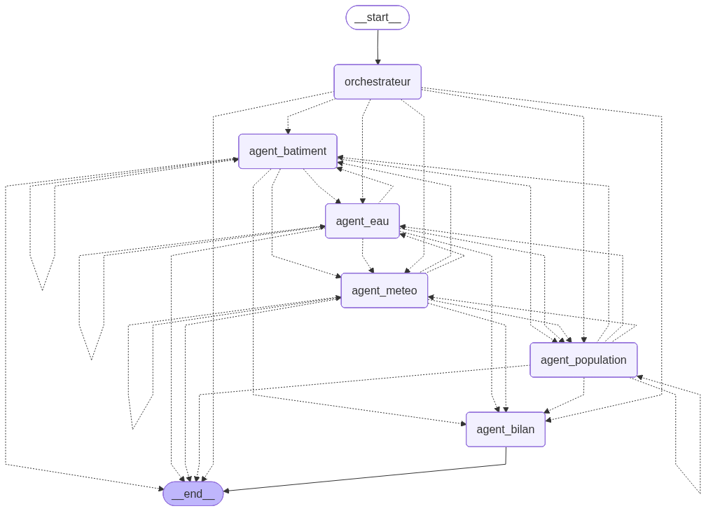
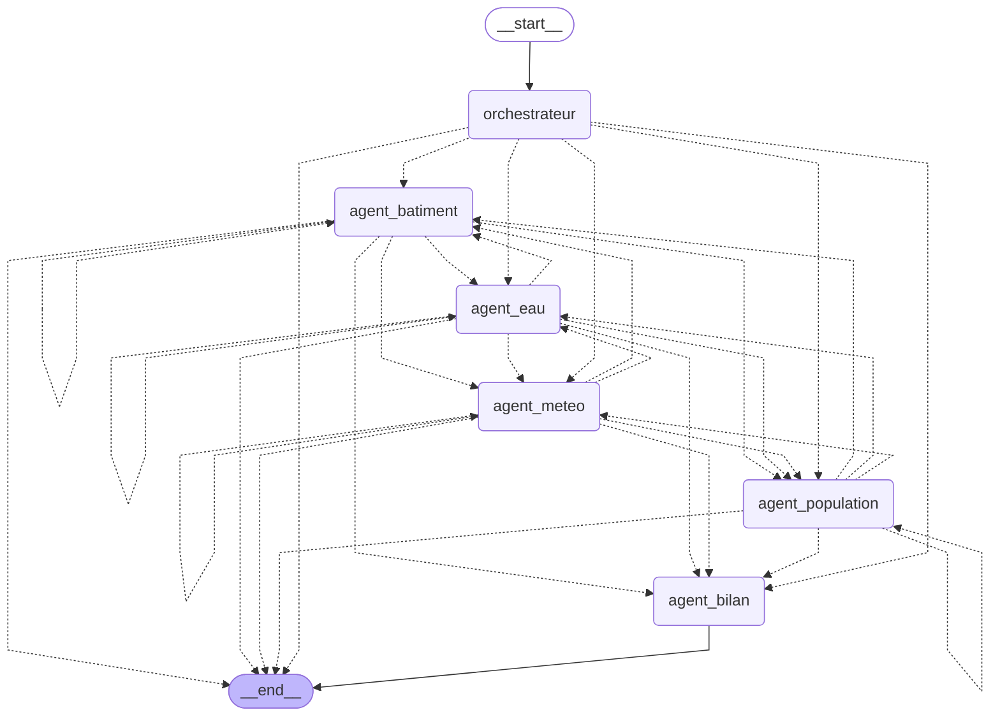

# Agents SDIS — Système multi-agents LangGraph

Cellule de crise conversationnelle pour les sapeurs-pompiers. Le système orchestre plusieurs agents IA spécialisés (hydraulique, bâtiment, population, météo) via un graphe LangGraph, puis consolide les résultats en une fiche de situation opérationnelle.

---

## Architecture du graphe

> Diagramme généré automatiquement via `app.get_graph(xray=True).draw_mermaid()` — voir `generate_graph.py`.





### Principe de fonctionnement

Le routeur n'est pas un nœud LLM — c'est une **fonction pure** qui lit la tête de la file `intents_restants` et dispatche vers l'agent correspondant. Chaque agent spécialisé retire son propre identifiant de la file avant de rendre la main au routeur, ce qui assure une exécution séquentielle déterministe sans race condition.

Quand l'utilisateur demande un **bilan**, l'orchestrateur injecte automatiquement tous les intents dans la file : `["eau", "batiment", "population", "meteo", "bilan"]`.

---

## Structure des fichiers

```
agents/
├── chatbot.py            # Point d'entrée CLI — streaming + mémoire par session
├── graph.py              # Construction du StateGraph LangGraph
├── state.py              # SDISState — TypedDict partagé entre tous les nœuds
├── llm.py                # Helper OpenAI gpt-4.1-mini
├── requirements.txt
├── .env                  # OPENAI_API_KEY (non versionné)
├── .env.example
│
├── nodes/
│   ├── orchestrateur.py  # Nœud 1 — classification Pydantic + extraction paramètres
│   ├── agent_eau.py      # Nœud 2 — expert hydraulique (create_agent)
│   ├── agent_batiment.py # Nœud 3 — expert structure/accès (create_agent)
│   ├── agent_population.py # Nœud 4 — expert population/ERP (create_agent)
│   ├── agent_meteo.py    # Nœud 5 — expert météo/risques (create_agent)
│   └── agent_bilan.py    # Nœud 6 — synthèse finale (LCEL, pas d'outils)
│
└── tools/
    ├── eau.py            # @tool wrappant skills/sdis-eau/main.py via subprocess
    ├── batiment.py       # @tool wrappant skills/sdis-batiment/main.py
    ├── population.py     # @tool wrappant skills/sdis-population/main.py
    └── meteo.py          # @tool wrappant skills/sdis-meteo/main.py
```

---

## État partagé — `SDISState`

```python
class SDISState(TypedDict):
    messages: Annotated[list, add_messages]  # historique conversation
    adresse: str                              # adresse du sinistre (persistée entre tours)
    rayon_m: int                              # rayon d'analyse en mètres
    intents_restants: list[str]              # file d'attente des agents à invoquer
    reponse_eau: str                          # résultat agent hydraulique
    reponse_batiment: str                     # résultat agent bâtiment
    reponse_population: str                   # résultat agent population
    reponse_meteo: str                        # résultat agent météo
    rapport_final: str                        # fiche COS consolidée
```

---

## Composants détaillés

### Orchestrateur (`nodes/orchestrateur.py`)

Utilise `llm.with_structured_output(IntentionSinistre)` pour extraire de manière fiable :
- l'adresse du sinistre (avec persistance si absente du message courant)
- le rayon d'analyse (défaut 500 m, bornes 100–2000 m)
- la liste des domaines à traiter

### Agents spécialisés (`nodes/agent_*.py`)

Chaque agent suit le pattern `create_agent(model, tools, system_prompt)` du cours. Les outils sont des fonctions `@tool` qui invoquent les skills Python existants via `subprocess.run(timeout=120)`.

| Agent | Outils | Données sources |
|-------|--------|-----------------|
| Hydraulique | `localiser_eau`, `calculer_autonomie_hydraulique` | OSM Overpass + IGN WFS |
| Bâtiment | `qualifier_batiment` | IGN BD Topo WFS + OSM |
| Population | `analyser_zone_population`, `analyser_vulnerables`, `lister_erp` | INSEE RP 2022 + BPE |
| Météo | `conditions_meteo_et_risque`, `alertes_crues_vigicrues` | Open-Meteo + Vigicrues |

### Agent Bilan (`nodes/agent_bilan.py`)

N'utilise pas `create_agent` — c'est une chaîne LCEL pure (`prompt | llm`) qui reçoit les quatre réponses spécialisées et génère une fiche structurée COS :
**SITUATION / RISQUES PRIORITAIRES / RESSOURCES / RECOMMANDATIONS**

---

## Installation

```bash
cd agents
pip install -r requirements.txt

# Créer le fichier .env
cp .env.example .env
# Puis renseigner OPENAI_API_KEY=sk-...
```

---

## Utilisation

```bash
# Session avec ID aléatoire
python chatbot.py

# Session nommée (pour reprendre une intervention)
python chatbot.py --thread intervention-42
```

### Exemples de questions

```
Pompier > Incendie au 15 rue des Lilas, Besançon. Points d'eau disponibles ?
Pompier > Quel est le type de bâtiment ?
Pompier > Génère la fiche de situation complète.
```

L'adresse est mémorisée dans la session : les tours suivants n'ont pas besoin de la répéter.

---

## Dépendances

| Bibliothèque | Rôle |
|---|---|
| `langgraph` | Orchestration du graphe d'agents |
| `langchain` | `create_agent`, outils `@tool`, prompts |
| `langchain-openai` | Connecteur `ChatOpenAI` (gpt-4.1-mini) |
| `python-dotenv` | Chargement de la clé API depuis `.env` |
| `requests` | Utilisé par les skills Python (BAN, IGN, OSM) |

---

*Projet étudiant IUT NFC-UMLP — Cours Agents LangChain, Prof. Christophe Guyeux.*
